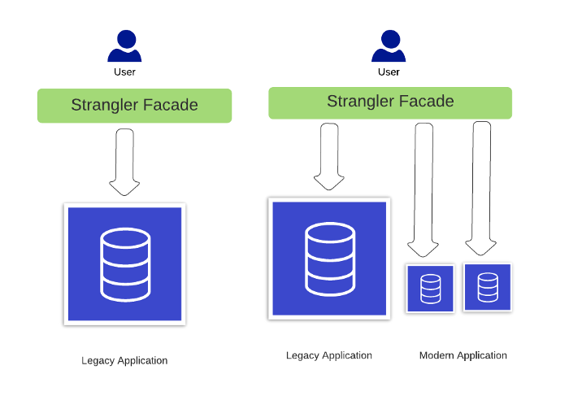

# Strangler

<!--  -->

    

Incrementally migrate a legacy system by gradually replacing specific pieces of functionality with new applications and services. As features from the legacy system are replaced, the new system eventually replaces all of the old system's features, strangling the old system and allowing you to decommission it.

## Context & Problem

- Completely replacing a complex system can be a huge undertaking. Often, you will need a gradual migration to a new system, while keeping the old system to handle features that haven't been migrated yet. However, running two separate versions of an application means that clients have to know where particular features are located. Every time a feature or service is migrated, clients need to be updated to point to the new location.

## Solution

- Incrementally replace specific pieces of functionality with new applications and services. Create a façade that intercepts requests going to the backend legacy system. The façade routes these requests either to the legacy application or the new services. Existing features can be migrated to the new system gradually, and consumers can continue using the same interface, unaware that any migration has taken place.

## Pros

This pattern helps: 
- __Minimize risk__ from the migration, and . With the façade safely routing users to the correct application, you can add functionality to the new system at whatever pace you like, while ensuring the legacy application continues to function. 
- __Spread the development effort over time__. Over time, as features are migrated to the new system, the legacy system is eventually "strangled" and is no longer necessary. Once this process is complete, the legacy system can safely be retired.

## Cons / Considerationsz

- Consider how to __handle services and data stores that are potentially used by both new and legacy systems__. Make sure both can access these resources side-by-side.

- Structure new applications and services in a way that they can __easily be intercepted and replaced in future__ strangler fig migrations.

- At some point, when the migration is complete, the strangler fig façade will either go away or evolve into an adaptor for legacy clients.

- Make sure the __façade keeps up with the migration__.

- Make sure the __façade doesn't become__ a single point of failure or a performance __bottleneck__.

## When to use

- Use:
    - Gradually migrating a back-end application to a new architecture.

- Not Use:
    - When requests to the back-end system cannot be intercepted.

    - For smaller systems where the complexity of wholesale replacement is low.

## References

- https://docs.microsoft.com/en-us/azure/architecture/patterns/strangler-fig

- https://microservices.io/patterns/refactoring/strangler-application.html
